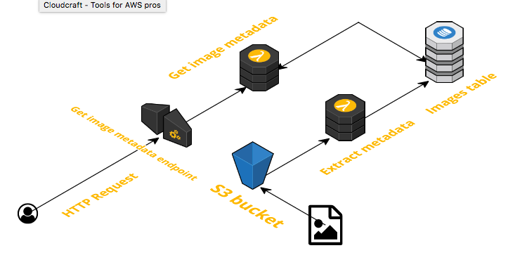

# serverless-challenge
Build a serverless architecture for image analysis 

Criação de uma solução Serverless Framework

Neste repositório você encontra os códigos de uma função lambda referente ao desafio de criação de funções Serverless para a solução de um aplicativo “Instagrão” com dificuldades em seu Serviço de análise de imagens em tempo real.

Introdução

o	Serverless Framework foi projetado para provisionar suas funções, eventos e recursos de infraestrutura do AWS Lambda com segurança e rapidez. Ele faz isso por meio de alguns métodos projetados para diferentes tipos de implantações.
o	O Serverless Framework converte toda serverless.yml sintaxe em um único modelo do AWS CloudFormation.

O Objetivo é demonstrar:

•	A estrutura básica de uma função do AWS Lambda em python;
•	Utilizando a API Gateway para chamar a função Lambda;
•	Criação tabela Amazon DynamoDB
•	Utilização do serviço Serverless Framework

O desenvolvimento foi feito no provedor AWS, utilizando as tecnologias:

●	Python 3.9
●	Amazon S3
●	AWS Lambda
●	Amazon DynamoDB
●	Amazon API Gateway
●	Serverless Framework

Estrutura

Para atender o desafio foi desenvolvido as funções lambdas em python abaixo:

●	Função ExtractMetadata: que é chamada quando um novo arquivo é carregado no S3. Ela irá extrair os metadados da imagem (dimensões, tamanho do arquivo) e armazenar no DynamoDB.

Após criação, ir até o bucket e criar a pasta uploads, devido a regra na função extractMetadata, e outra regra que poderá carregar somente arquivos com extensão .jpg.

rules:
  - prefix: uploads/
  - suffix: .jpg

●	Função GetMetadata, que recebe a requisição de um endpoint criado pelo AWS API Gateway. Ele irá receber o parâmetro s3objectkey e retornar os metadados armazenados no DynamoDB.
Caminho de rota para acesso a função:
path: images/{s3objectkey}

●	Função GetImage, que recebe como parâmetro o s3objectkey e faz o download da imagem.
Caminho de rota para acesso a função:
path: downloadimages/{s3objectkey}

●	Função InfoImages, que não recebe nenhum parâmetro e pesquisa os metadados salvos no DynamoDB para retornar as seguintes informações:
✔	Qual é a imagem que contém o maior tamanho.
✔	Qual é a imagem que contém o menor tamanho.
✔	Quais os tipos e quantidade de cada tipo de imagem salvas no S3.

Caminho de rota para acesso a função:
path: infoimages

Todas as funções lambdas serão executadas pela API Gateway.

No desenvolvimento não consegui empacotar a biblioteca Pillow para subir com o serverless deploy, então coloquei os comandos de instalação dessa biblioteca em runtime.

    subprocess.call('pip install Pillow -t /tmp/ --no-cache-dir'.split(), stdout=subprocess.DEVNULL, stderr=subprocess.DEVNULL)
    sys.path.insert(1, '/tmp/')
    from PIL import Image

As Variáveis de ambiente para ser alterado no arquivo serverless.yml, são o nome tabela 'DYNAMODB_TABLE' e nome do bucket 'BUCKET_NAME' .

environment:
  DYNAMODB_TABLE: tbl_image
  BUCKET_NAME: bucketdesafioirene30

Comandos utilizados para execução do serverless:

●	Para instalar o serverless:
	npm install serverless -g

●	Comando para iniciar com o Serverless Cloud.	
npm i -g @serverless/cloud
npm init cloud

●	Comando para configurar o perfil:
serverless config credentials --provider provider --key key --secret secret

●	Comando para executar o deploy no  serveless:
	serverless deploy --region us-east-1
